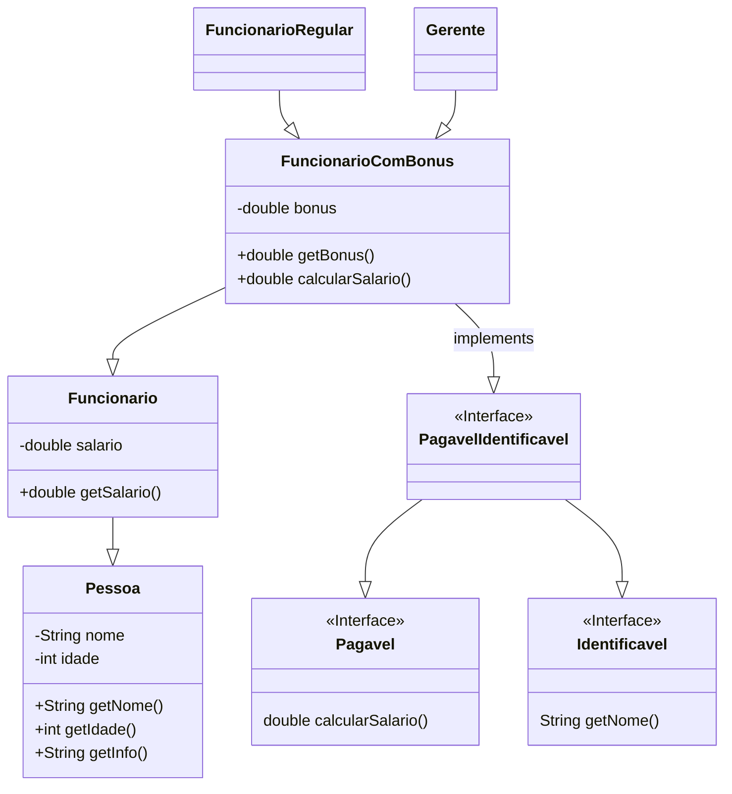

# Simulado P2 POO

### 01.


```java
public abstract class Pessoa {
	private String nome;
	private int idade;

	public Pessoa(String nome, int idade) {
		this.nome = nome;
		this.idade = idade;
	}

	public String getNome() {
		return this.nome;
	}

	public int getIdade() {
		return this.idade;
	}

	public String getInfo() {
		return "Nome: " + getNome() + "\nIdade: " + getIdade();
	}
}

public class Funcionario extends Pessoa {
	private double salario;

	public Funcionario(String nome, int idade, double salario) {
		super(nome, idade);
		this.salario = salario;
	}

	public double getSalario() {
		return this.salario;
	}

	@Override
	public String getInfo() {
		return "Nome: " + getNome() + "\nIdade: " + getIdade() + "\nSalario: " + getSalario();
	};
}

public interface Pagavel {
	double calcularSalario();
}

public interface Identificavel {
	String getNome();
}

public class FuncionarioComBonus extends Funcionario implements PagavelIdentificavel {
	private double bonus;

	public FuncionarioComBonus(String nome, int idade, double salario, double bonus) {
		super(nome, idade, salario);
		this.bonus = bonus;
	}

	public double getBonus() {
		return this.bonus;
	}

	public double calcularSalario() {
		return (1 + getBonus()) * getSalario();
	}

	@Override
	public String getInfo() {
		return "Nome: " + getNome() + "\nIdade: " + getIdade() + "\nSalario: " + calcularSalario();
	}

}

public interface PagavelIdentificavel extends Pagavel, Identificavel {}

public class FuncionarioRegular extends FuncionarioComBonus {
	public FuncionarioRegular(String nome, int idade, double salario) {
		super(nome, idade, salario, 0.05);
	}
}

public class Gerente extends FuncionarioComBonus {
	public Gerente(String nome, int idade, double salario) {
		super(nome, idade, salario, 0.1);
	}
}

public class Sistema {
	public static void exibirInfosDoFuncionario(FuncionarioComBonus f) {
		System.out.println(f.getInfo());
	}
}
```

### 02.

> Desenhe um diagrama de classe do exercício anterior.



### 03.


```java
public abstract class Tabela {
	abstract String getInsertQuery();
}

public class Produto extends Tabela {
	private String nome;
	private double preco;

	public String getInsertQuery() {
		return "INSERT INTO produtos(nome, preco) VALUES (" + getNome() + ", " + getPreco() + ")";
	}
}

public class Cliente extends Tabela {
	private String nome;
	private String email;

	public String getInsertQuery() {
		return "INSERT INTO clientes(nome, email) VALUES (" + getNome() + ", " + getEmail() + ")";
	}
}

public class Sistema {
	public static void exibeInsertQueries(List<Tabela> tabelas) {
		for (Tabela t : tabelas) {
			System.out.println(t.getInsertQuery());
		}
	}
}
```

### 04.

> Explique todos os conceitos de orientação a objetos presentes em sua solução, apontando qual classe e qual método foi utilizado.

- `Herança`: As classes `Cliente` e `Produto` herdam da classe abstrata `Tabela`, portanto ambas possuem implementações do método `String getInsertQuery` declarado na classe mãe.
- `Polimorfismo`: O método `Tabela.getInsertQuery()` é implementado de formas diferentes por `Cliente` e `Produto`. Portanto, o método `Sistema.exibeInsertQueries(List<Tabela> tabelas)` terá diferentes retornos dependo de qual classe concreta o método `t.getInsertQuery()` está sendo chamado.
- `Encapsulamento`: As classes `Produto` e `Cliente` encapsulam seus atributos, setando-os como `private` e declarando de forma pública apenas os métodos getter para estes atributos.
